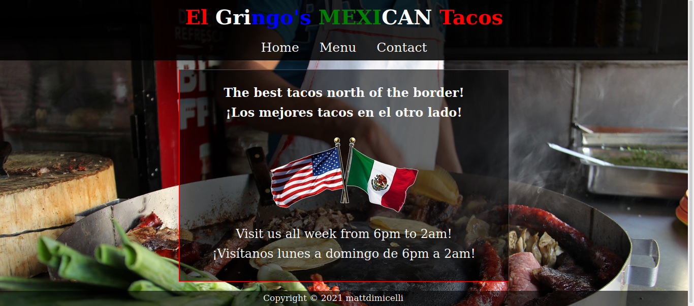

# Readme
# El Gringo's Mexican Tacos

## Overview

A single-page application website for a taco stand.  The point of this assignment
was to practice DOM manipulation by dynamically rendering the page... JS
alone would be used to generate the contents of the website.

### Challenge

The complete design requirements from the The Odin Project curriculum can be seen
[here](https://www.theodinproject.com/paths/full-stack-javascript/courses/javascript/lessons/restaurant-page).  

### Screenshot

  

### Links

- [Live site](https://mattdimicelli.github.io/Unos_Tacos_Sin_HTML/)
- [Repo](https://github.com/mattdimicelli/Unos_Tacos_Sin_HTML/)

## My process

### Built with
- Just JS and CSS... no HTML!
- ES6 Modules
- Webpack
- Github pages

### What I learned

This was my first time ever building an entire website from JS, and that involved
learning how to use the DOM API and set up an appropriate file structure.
I learned to set up tabbed browsing for a SPA.  I realized that despite being a 
SPA, that I could re-render only the portions of the page which needed to be
re-rendered (which is performant).  I also practiced building with
Webpack and using features such as "watch".    

